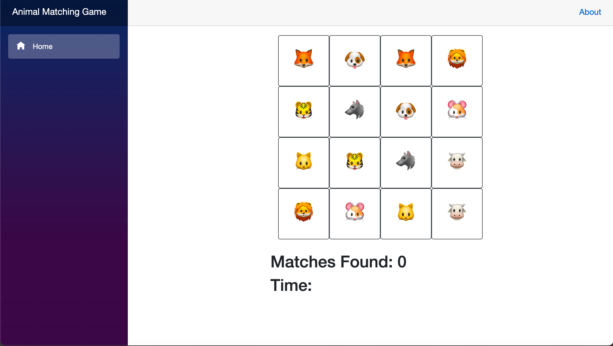

 <h1>My Animal Matching Game</h1>
  
 
<h3>Languages And Frameworks</h3>
<ul>
  <li>C#</li>
  <li>Blazer</li>
  <li>Bootstrap</li>
</ul>

<h3>Gameplay</h3>
  
  <h3>Demo</h3>
  

My emoji animal matching game can be played by simply clicking once on an emoji and clicking in the identical emoji immediately after. I have incorporated a match counter under the game grid and also a timer activated at the moment of the first emoji click and deactivated at the moment all matches have been found

# CSharpExercises
# CSharpExercises
